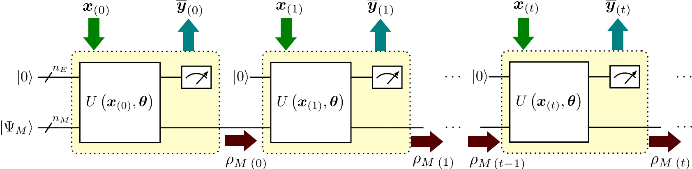

# qutims
Release version 1 (Nov 23) of QUTIMS repository

## Description
**QUTIMS** is a repository with **Qu**antum Machine Learning algorithms for Multivariate **Tim**e *S*eries prediction.
QUTIMS tasks are performed through Quantum Recurrent Neural Networks (QRNNs), which at the NISQ era of quantum computing are mainly emulated thorugh classical computer.
The repository contains **QURECNETS**, a 100 \% python module to train and test **Qu**antum **Rec**urrent Neural **Net**work**s** and make accurate multivariate time series predictions.
**QURECNETS** relies on a specific Density Matrix method that emulates QRNNs, following the mathematical formulation available at [arXiv:2310.20671](https://arxiv.org/abs/2310.20671).
Examples with different datasets are included as a guide to a more friendly use.

## Requirements
**QURECNETS** is characterized by its low package requirements. It requires **Python 3**.

The following packages are mandatory to be installed, in the indicated version or a newer one (we cannot assure that an older version will work):

[NumPy 1.24.2](https://numpy.org/doc/stable/release/1.24.2-notes.html)
[SciPy 1.8.1](https://docs.scipy.org/doc/scipy-1.8.1/index.html)

We recommend to have installed:

[Matplotlib 3.5.2](https://matplotlib.org/3.5.3/users/index.html)

## Content
- `qurecnets` is a module for time series prediction.
    - `qualgebra` is a module with some basic states and operators of gates that make up the algebra needed to emulate circuits.
    - `emc`. The available QRNN model is **EMC** (**E**xchange-**M**emory **C**ontrolled gates), based on a quantum circuit that iteratively encodes and returns information (exchange), and evolves by the repetitive application of a quantum operator, a hardware-efficient *ansatz*. This structure is represented in Fig. 1.
        - `dm` contains the Density Matrix emulator of the QRNN-EMC as a class, `emc`. The default ansatz is EMCZ3. Further description is found in Fig. 2. Different ansatze can be added by overwritting the `emcz3_ansatz` method. The class includes methods for analytical and gradient computation, based on the Parameter Shift Rule. The code is optimized fto run in sequential process. The class `emc_optimization` inherits the previous class to make an efficient framework for QRNN training.
        - `mp` contains a Density Matrix emulator for the specific QRNN-EMCZ3, avoiding classes. This submodule is optimized for gradient computation using parallel processors for each partial derivative. It also contains a function for the QRNN training. This module is highly recommended in HPC environments, but not in low-resources devices.
- `test` contains scripts to test the developed software.
- `demos` contains scripts to generate synthetic time series and examples of scripts to train, validate and test QRNNs with the available datasets.
     

![***Fig.2*** QRNN ansatz, $U (\bm{x}_{(t)}, \bm{\theta})$, consisting of two parts. The first one is the data encoding, and gates inside the orange box are repeated with different parameters, that are a subset of trainable parameters, $\bm{\alpha}_i^r \in \{\bm{\theta}\}$. We use use one qubit per input variable. The second one is the evolution and entanglement part, where the blue box is repeated $L$ times (layers). Each layer is a column of $U_3$ rotations parameterised by a threesome of parameters, $\bm{\beta}_i^l \in \{ \bm{\theta} \}$, and CZ gates entangling every qubit from E with every qubit from M. A final column of $U_3$ gates is applied over register E before measurement.](.images/quantum_ansatz.png)

