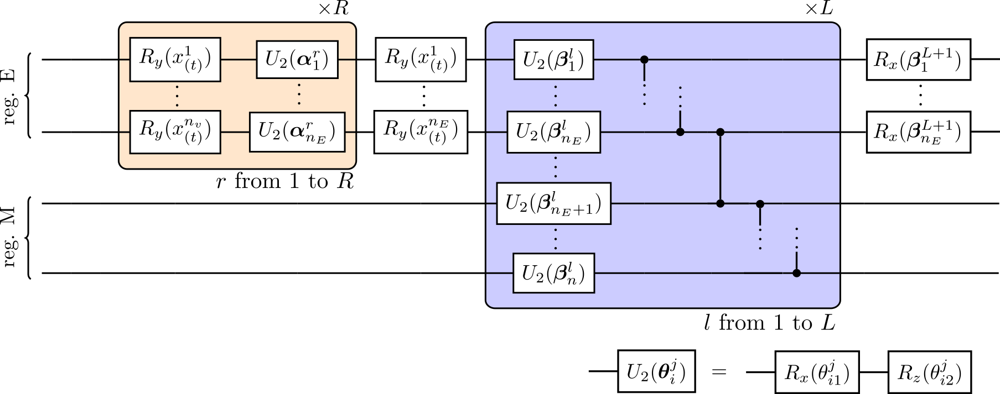
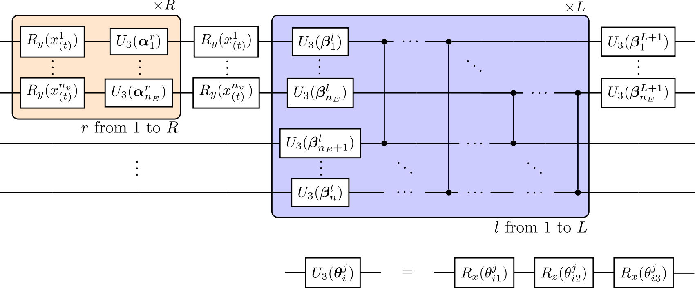

# qutims
Release version 0.2 (Jul 24) of QUTIMS repository.

## Description
**QUTIMS** is a repository with **Qu**antum Machine Learning algorithms for Multivariate **Tim**e *S*eries prediction.
QUTIMS tasks are performed through Quantum Recurrent Neural Networks (QRNNs), which at the NISQ era of quantum computing are mainly emulated with a classical computer.
The repository contains **QURECNETS**, a 100 \% python module to train and test **Qu**antum **Rec**urrent Neural **Net**work**s** and make accurate multivariate time series predictions.
**QURECNETS** relies on a specific Density Matrix method that emulates QRNNs.
<!---
following the mathematical formulation available at [arXiv:2310.20671_v2](https://arxiv.org/abs/2310.20671_v2).
Examples with different datasets are included as a guide for a more friendly use.
--->

## Requirements
**QURECNETS** is characterized by its low package requirements. It requires **Python 3**.

The following packages are mandatory to be installed, in the indicated version or a newer one (we cannot assure that an older version will work):

[NumPy 1.26.4](https://numpy.org/doc/1.26/index.html) \
[PennyLane 0.36.0](https://pennylane.ai/)

We recommend to have installed:

[Dask 2024.5.0](https://docs.dask.org/en/stable/changelog.html#v2024-5-0) \
[Matplotlib 3.5.2](https://matplotlib.org/3.5.3/users/index.html)

## Installation
For a correct installation of PennyLane, Dask and NumPy, we recommend to create a conda environment from the .yml file.
> conda env create -n env_name -f pennylane_dask.yml

For the installation of ``qutims`` library containing ``qurecnets`` module and subsequent modules, use ``pip``.
> pip install qutims-0.2.tar.gz

## Content
- `qurecnets` is a module for time series prediction.
    - `qualgebra` is a module with some basic states and operators of gates that make up the algebra needed to emulate circuits.
    - `emc`. The available QRNN model is **EMC** (**E**xchange-**M**emory with **C**ontrolled gates), based on a quantum circuit that iteratively encodes and returns information (exchange), and evolves by the repetitive application of a quantum operator, a hardware-efficient *ansatz*. This structure is represented in Fig. **1**.
        - `emulator` is a class that contains the methods for emulating the QRNN with an operator-sum representation. It includes numerical and analytical first- and second-order
        partial derivative methods for computing the gradients and the Hessian of both the circuit outputs and the loss functions. Gradients support parallel computation.
        - `EMCZ2` is a class that builds the complete model of QRNN with a hardware-efficient ansatz described in Fig. **2**. This ansatz introduces linear entanglement.
        - `EMCZ3` is a class that builds the complete model of QRNN with an ansatz described in Fig. **3**. This ansatz entangles every qubit of reg. E with every qubit in reg. M.
    - `models`. Library of parameterised operators for encoding and evolution.
    - `readout`. Defines functions for expectation value computation from circuit outputs. 
    - `loss_fs`. Defines functions for Loss function computation.
    
- `test` contains scripts to test the developed software.
- `cases` contains scripts to generate synthetic time series and examples of scripts to train, validate and test QRNNs with the available datasets.

&emsp;

**Figure 1:** General form of the QRNN circuit. Arrows show the information flux.

&emsp;

**Figure 2:** QRNN ansatz, $U (x_{(t)}, \theta)$, consisting of two parts. The first one is the data encoding, and gates inside the orange box are repeated with different parameters, that are a subset of trainable parameters, $\alpha_i^r \in \{\theta\}$. We use use one qubit per input variable. The second one is the evolution and entanglement part, where the blue box is repeated $L$ times (layers). Each layer is a column of $R_z R_x$ rotations parameterised by a pair of parameters, $\beta_i^l \in \{ \theta \}$, and a ladder of CZ gates. A final column of $R_x$ gates is applied over register E before measurement.

&emsp;

**Figure 3:** QRNN ansatz, $U (x_{(t)}, \theta)$, consisting of two parts. The first one is the data encoding, and gates inside the orange box are repeated with different parameters, that are a subset of trainable parameters, $\alpha_i^r \in \{\theta\}$. We use use one qubit per input variable. The second one is the evolution and entanglement part, where the blue box is repeated $L$ times (layers). Each layer is a column of $U_3$ rotations parameterised by a threesome of parameters, $\beta_i^l \in \{ \theta \}$, and CZ gates entangling every qubit from E with every qubit from M. A final column of $U_3$ gates is applied over register E before measurement.

## Reference
The original work about Density Matrix emulation of QRNNs has been published at [arXiv:2310.20671](https://arxiv.org/abs/2310.20671).

## Contact
The author encourages the user to contact him in case of doubt or need for further details by emailing ``jdviqueira@cesga.es`` or ``josedaniel.viqueira@rai.usc.es``.

## Acknowledgments
We thank the [CESGA](https://www.cesga.es/en/home-2/) Quantum Computing Group members for their feedback and the stimulating intellectual environment they provide. We thank [G. Ferro](https://github.com/gonfeco) for his help with Dask parallelisation. This work was supported by Axencia Galega de Innovación through the Grant Agreement *"Despregamento dunha infraestructura baseada en tecnoloxías cuánticas da información que permita impulsar a I+D+I en Galicia"* within the program FEDER Galicia 2014-2020. J. D. Viqueira was supported by *Axencia Galega de Innovación* (Xunta de Galicia) through the *"Programa de axudas á etapa predoutoral"*. Simulations on this work were performed using Galicia Supercomputing Center (CESGA) FinisTerrae III supercomputer with financing from the Programa Operativo Plurirregional de España 2014-2020 of ERDF, ICTS-2019-02-CESGA-3, and the Qmio quantum infrastructure, funded by *Axencia Galega de Innovación* through the Grant Agreement *``Despregamento dunha infraestructura baseada en tecnoloxías cuánticas da información que permita impulsar a I+D+I en Galicia''* within the program FEDER Galicia 2014-2020.